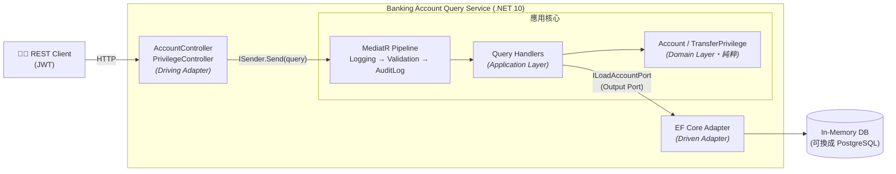
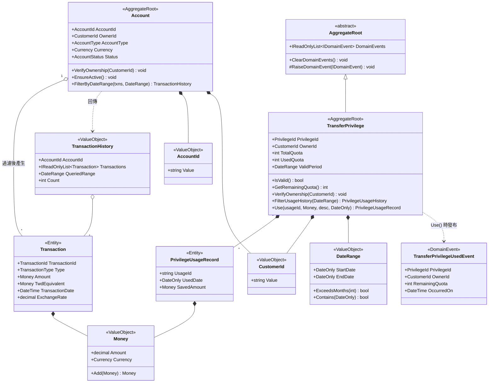
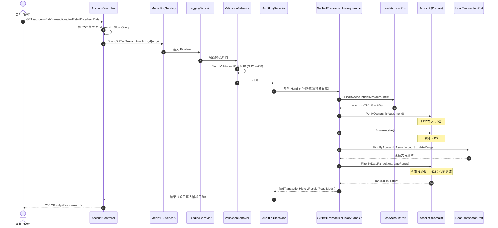
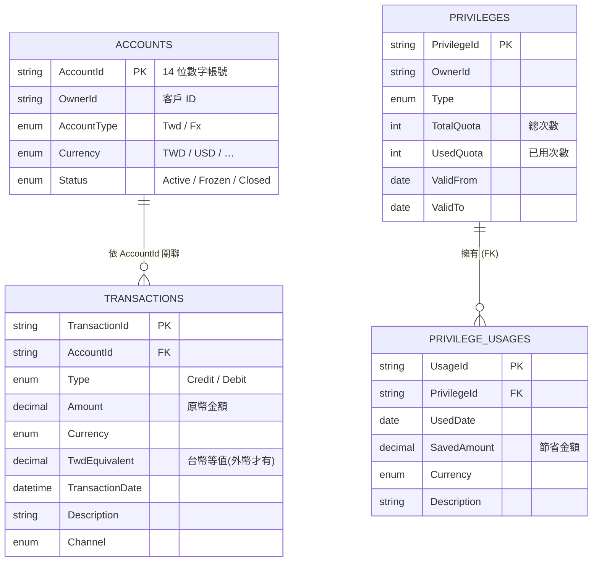
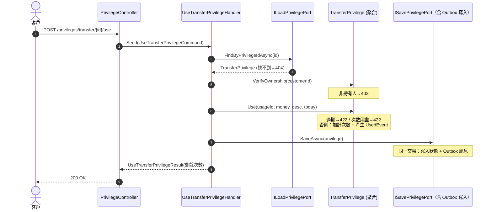
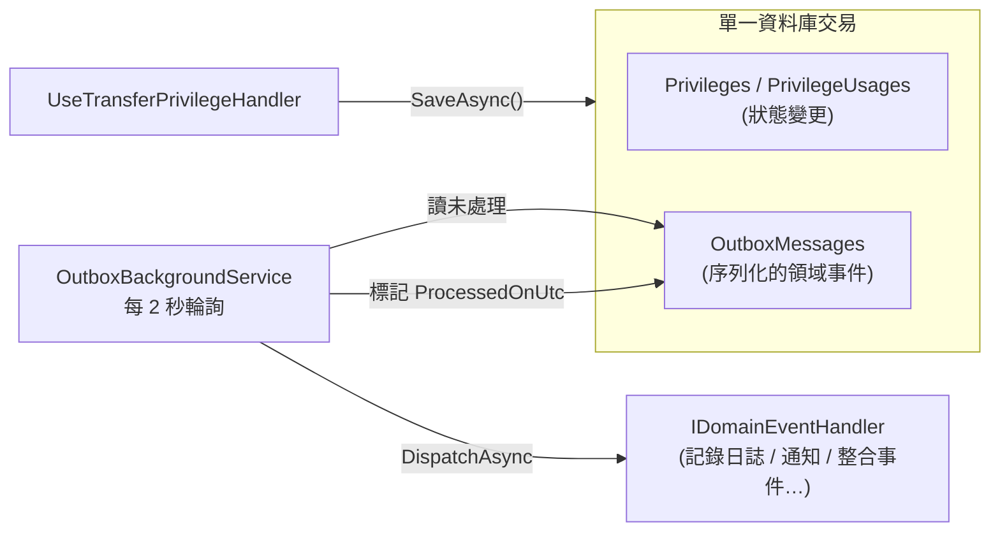

# 銀行帳戶查詢 API — DDD · Hexagonal · CQRS 教學專案

> 以 **.NET 10 + MediatR** 實作的銀行帳戶查詢服務，示範如何把
> **領域驅動設計（DDD）**、**六角形架構（Hexagonal Architecture）**、
> **命令查詢職責分離（CQRS）** 與 **SOLID** 原則組合在一起。
>
> 這份 README 是寫給**初學者**的：即使你沒接觸過這些名詞，也能照著讀懂
> 這個程式碼庫「為什麼這樣設計」。完整的架構規劃文件請見
> [`banking-api-tutorial-dotnet.md`](./banking-api-tutorial-dotnet.md)。

---

## 目錄

1. [這個專案在做什麼](#1-這個專案在做什麼)
2. [先備知識：5 個關鍵名詞](#2-先備知識5-個關鍵名詞)
3. [架構總覽](#3-架構總覽)
4. [專案結構](#4-專案結構)
5. [類別圖（Class Diagram）](#5-類別圖class-diagram)
6. [循序圖（Sequence Diagram）](#6-循序圖sequence-diagram)
7. [實體關聯圖（ER Diagram）](#7-實體關聯圖er-diagram)
8. [設計重點逐項說明](#8-設計重點逐項說明)
9. [API 端點](#9-api-端點)
10. [如何執行與測試](#10-如何執行與測試)
11. [BDD 行為驅動開發測試](#11-bdd-行為驅動開發測試)
12. [設計決策（ADR 摘要）](#12-設計決策adr-摘要)
13. [尚未實作的部分](#13-尚未實作的部分)

---

## 1. 這個專案在做什麼

它提供 4 個**唯讀查詢（Query）**與 1 個**寫入命令（Command）**功能給已登入的銀行客戶：

| 類型 | 功能 | 說明 |
|------|------|------|
| Query | 台幣活存交易紀錄查詢 | 依日期區間查詢台幣帳戶進出 |
| Query | 外幣活存交易紀錄查詢 | 依幣別與日期區間查詢，顯示原幣與台幣等值 |
| Query | 轉帳優惠內容查詢 | 查詢可用優惠（剩餘免手續費次數、是否有效） |
| Query | 轉帳優惠使用紀錄查詢 | 查詢已使用的優惠歷史 |
| **Command** | **使用一次轉帳優惠** | **扣減剩餘次數、留下使用紀錄、發布領域事件（寫入側 DDD 示範）** |

幾條**業務規則**貫穿全程，而且它們被刻意放在「領域層」集中守護：

- 客戶只能查／使用自己名下的帳戶／優惠（**所有權驗證**）
- 查詢區間不得超過 **13 個月**
- 凍結帳戶不可查詢
- 使用優惠時**必須在有效期間內、且仍有剩餘次數**（寫入側不變量）
- 每次查詢／命令都要留下**稽核日誌**

---

## 2. 先備知識：5 個關鍵名詞

| 名詞 | 一句話解釋 | 在本專案的例子 |
|------|-----------|---------------|
| **Aggregate（聚合）** | 一群總是一起變動的物件，由一個「根」對外，業務規則寫在根裡面 | `Account`、`TransferPrivilege` |
| **Value Object（值物件）** | 沒有身分、只看內容值、不可變的物件 | `Money`、`DateRange`、`CustomerId` |
| **Port（埠）/ Adapter（轉接器）** | Port 是「介面（需要什麼）」，Adapter 是「實作（怎麼做到）」 | `ILoadAccountPort`（Port）↔ `AccountEfCoreAdapter`（Adapter） |
| **CQRS** | 把「讀」和「寫」分開設計；本專案只做讀（Query） | `GetTwdTransactionHistoryQuery` |
| **MediatR** | 行程內的訊息匯流排，讓 Controller 不用直接認識 Handler | `ISender.Send(query)` |

> 💡 **一個核心原則貫穿全部設計**：**依賴方向永遠由外往內**。
> 最外層（Web、資料庫）依賴內層（應用、領域），而**最內層的領域層不依賴任何人**。

---

## 3. 架構總覽

> 📊 下方所有圖以 Mermaid 撰寫，GitHub 會直接渲染。若你的檢視器不支援，
> 可改看預先渲染的 PNG：[`docs/diagrams/`](./docs/diagrams/)
> （[架構](./docs/diagrams/architecture.png)、
> [類別圖](./docs/diagrams/class-diagram.png)、
> [查詢循序圖](./docs/diagrams/sequence-diagram.png)、
> [ER 圖](./docs/diagrams/er-diagram.png)、
> [使用優惠循序圖](./docs/diagrams/use-privilege-sequence.png)、
> [Outbox 流程圖](./docs/diagrams/outbox.png)）。

六角形架構把系統畫成一個「六角形」：中間是純粹的業務核心，外面用 Port／Adapter
跟真實世界（HTTP、資料庫、快取）溝通。左邊是「主動呼叫我們」的（Driving），
右邊是「被我們呼叫」的（Driven）。



**依賴規則**（箭頭代表「依賴」，內層不知道外層存在）：

```
Infrastructure  →  Application  →  Domain
   (最外層)          (協調層)        (最內層・零 NuGet 依賴)
```

---

## 4. 專案結構

```
BankAccountQuery/
├── src/
│   ├── BankAccountQuery.Domain/          ← 領域層：業務規則，零 NuGet 依賴
│   │   ├── Common/                       #   AggregateRoot 基底、IDomainEvent（領域事件）
│   │   ├── Model/Shared/                 #   Money, DateRange, CustomerId, Currency
│   │   ├── Model/Account/                #   Account 聚合 + Transaction + …
│   │   ├── Model/Privilege/              #   TransferPrivilege 聚合 + TransferPrivilegeUsedEvent
│   │   └── Exceptions/                   #   業務語意例外（DomainException）
│   │
│   ├── BankAccountQuery.Application/      ← 應用層：用例 + Port 定義 + MediatR
│   │   ├── Ports/Out/                    #   Output Port（含 ISavePrivilegePort、IDomainEventDispatcher）
│   │   ├── Queries/                      #   讀取側：Query + Handler + Result DTO + Validator
│   │   ├── Commands/                     #   寫入側：Command + Handler + 領域事件處理者
│   │   ├── Behaviors/                    #   Pipeline：Logging / Validation / AuditLog
│   │   └── Common/                       #   ICustomerQuery, IDomainEventHandler, 分頁, 驗證例外
│   │
│   ├── BankAccountQuery.Infrastructure/   ← 基礎設施層：Adapter（實作 Port）
│   │   ├── Adapters/In/Web/              #   Controller, GlobalExceptionHandler, JWT
│   │   ├── Adapters/Out/Persistence/     #   EF Core DbContext + Adapter（讀+寫）+ 種子資料
│   │   ├── Adapters/Out/Events/          #   DomainEventDispatcher（從 DI 解析 handler）
│   │   └── Configuration/                #   DI 註冊（MediatR, Validators, Adapters, 領域事件）
│   │
│   └── BankAccountQuery.Api/              ← 組合根：Program.cs + appsettings.json
│
└── tests/
    ├── BankAccountQuery.Domain.Tests/         # 純 C# 單元測試（33）
    ├── BankAccountQuery.Application.Tests/     # NSubstitute Mock Port（13）
    ├── BankAccountQuery.Infrastructure.Tests/  # WebApplicationFactory 整合測試（18，含 Outbox）
    └── BankAccountQuery.BddTests/              # Reqnroll + Gherkin 情境測試（17）
```

> **為什麼 Repository 介面放在「應用層」而不是「領域層」？**
> 因為「需要什麼資料」是應用層（Handler）的職責；領域層只定義模型本身，
> 對「資料怎麼來」一無所知。所以 Output Port 定義在 `Application/Ports/Out/`，
> 由基礎設施層的 Adapter 實作。

---

## 5. 類別圖（Class Diagram）

領域層的核心模型。注意：**所有業務方法都在聚合根（Account、TransferPrivilege）裡**，
值物件負責保護自己的不變量（例如 `Money` 不允許負數）。



---

## 6. 循序圖（Sequence Diagram）

以「查詢台幣交易紀錄」為例，看一筆請求如何流經各層。
重點：**Controller 不含業務邏輯，Handler 只協調，所有業務判斷都委派給領域模型**。



---

## 7. 實體關聯圖（ER Diagram）

基礎設施層用 **EF Core** 把資料存進資料庫（本專案預設用 In-Memory，可換成 PostgreSQL）。
這些**持久化實體（Entity）只存在於基礎設施層**，會在 Adapter 裡轉換成領域模型 —
領域層完全不知道資料表長什麼樣。



> 註：`ACCOUNTS → TRANSACTIONS` 在程式中以 `AccountId` 加索引關聯（非外鍵約束），
> 這呼應 ADR-002：交易在查詢時「暫時脫離聚合邊界」以避免一次載入數萬筆。

---

## 8. 設計重點逐項說明

### 8.1 領域層為何「零 NuGet 依賴」
打開 `BankAccountQuery.Domain.csproj`，你會發現它**沒有任何套件參考**。
這是刻意的：領域層是系統最穩定、最核心的部分，不該因為換了 ORM、換了訊息框架而被牽動。
連 MediatR 都不准進來。

### 8.2 業務規則封裝在聚合裡，而不是散落在 Handler
比較這兩種寫法：

```csharp
// ❌ 反例：業務判斷漏到應用層
if (account.OwnerId != customerId) throw ...;

// ✅ 本專案：呼叫領域方法，判斷邏輯在 Account 裡
account.VerifyOwnership(customerId);
```

好處：規則只有一個源頭、容易測試、不會在多個 Handler 重複。

### 8.3 值物件保護自己的不變量
`Money` 在建構時就拒絕負數與超過 2 位小數；`AccountId` 強制 14 位數字；
`DateRange` 不允許起日晚於迄日。**錯誤的物件根本無法被建立出來**，
這比「建立後再檢查」更安全。

### 8.4 Output Port + Adapter＝依賴反轉
Handler 只依賴介面 `ILoadAccountPort`（我「需要」載入帳戶），
不認識 `AccountEfCoreAdapter`（「怎麼」用 EF Core 載入）。
於是同一個 Port 可以有多種實作（EF Core、Redis 快取、HTTP），
測試時還能換成假的 Mock —— 這就是 SOLID 的 **D（依賴反轉）**。

### 8.5 MediatR Pipeline＝橫切關注點的正確位置
記錄日誌、驗證參數、寫稽核 —— 這些「每個查詢都要做」的事，
不該複製貼到每個 Handler。它們被做成 **Pipeline Behavior**，
像洋蔥一樣層層包住 Handler：

```
Logging → Validation → AuditLog → Handler.Handle()
```

`AuditLogBehavior` 只挑實作了 `ICustomerQuery` 介面的查詢來記錄（介面隔離，SOLID 的 **I**）。

### 8.6 全域例外處理：領域例外 → HTTP 狀態碼
領域層丟出有業務語意的例外（如 `AccountNotActiveException`），
`GlobalExceptionHandler`（.NET 8+ 的 `IExceptionHandler`）用一個 `switch` 把它們
對應到 HTTP 狀態碼，Controller 完全不用寫 try/catch：

| 例外 | HTTP |
|------|------|
| `AccountNotFoundException` | 404 |
| `AccountNotOwnedByCustomerException` | 403 |
| `AccountNotActiveException` / `QueryRangeExceededException` | 422 |
| `QueryValidationException` | 400 |

### 8.7 寫入側（Command）＝聚合真正「工作」的地方

讀取側的聚合主要在做授權與過濾；**寫入側才是 DDD 聚合的主場**：它在「改變狀態」時
強制守護**不變量（Invariant）**。本專案以 `UseTransferPrivilegeCommand`（使用一次優惠）示範。

核心方法 `TransferPrivilege.Use(...)` 把規則寫死在聚合裡——任一不變量違反，**狀態完全不變**：

```csharp
public PrivilegeUsageRecord Use(string usageId, Money savedAmount, string description, DateOnly usedDate)
{
    if (!ValidPeriod.Contains(usedDate))      throw new PrivilegeExpiredException(PrivilegeId);      // 不變量 1：須在有效期
    if (GetRemainingQuota() <= 0)             throw new PrivilegeQuotaExhaustedException(PrivilegeId); // 不變量 2：須有剩餘次數

    var record = new PrivilegeUsageRecord(usageId, usedDate, savedAmount, description);
    _usageRecords.Add(record);
    UsedQuota += 1;
    RaiseDomainEvent(new TransferPrivilegeUsedEvent(...));  // 發布領域事件
    return record;
}
```

**領域事件（Domain Event）** 由聚合的 `AggregateRoot` 基底收集。`SaveAsync` 會把這些事件
**與狀態變更寫在同一次 `SaveChanges`（同一交易）**到 **Outbox** 表（見 §8.8），
之後由背景處理器可靠地派發給各 `IDomainEventHandler`。
依本專案原則，領域事件**不直接用 MediatR 的 `INotification`**，而是走自訂的 Dispatcher Port，
讓領域層維持零框架依賴。



### 8.8 Transactional Outbox＝領域事件的可靠交付

若在「資料庫已提交」但「事件還沒派發」之間程序崩潰，事件就永久遺失了。
**Transactional Outbox** 解決這個問題：把事件當成一筆資料，**和聚合狀態寫在同一個交易**裡；
再由獨立的背景處理器讀取未處理的事件、派發、標記完成（**至少一次**交付）。



- 寫入：`PrivilegeEfCoreAdapter.SaveAsync` 序列化 `privilege.DomainEvents` 寫入 `OutboxMessages`。
- 派發：`OutboxProcessor.ProcessPendingAsync` 讀未處理 → 反序列化 → `IDomainEventDispatcher` →
  標記 `ProcessedOnUtc`；單筆失敗只記 `Error` 不影響其他訊息。
- 觸發：`OutboxBackgroundService`（`BackgroundService`）每 2 秒以新的 DI Scope 執行一次。

> ⚠️ 目前為單體內的 Outbox（同一資料庫）；尚未把事件再轉發到外部訊息佇列（整合事件）。

---

## 9. API 端點

| Method | Path | 說明 | 認證 |
|--------|------|------|------|
| `GET` | `/api/v1/accounts/{accountId}/transactions/twd` | 台幣交易紀錄 | JWT |
| `GET` | `/api/v1/accounts/{accountId}/transactions/fx?currency=USD` | 外幣交易紀錄 | JWT |
| `GET` | `/api/v1/customers/me/privileges/transfer` | 轉帳優惠內容 | JWT |
| `GET` | `/api/v1/customers/me/privileges/transfer/{privilegeId}/usage` | 優惠使用紀錄 | JWT |
| `POST` | `/api/v1/customers/me/privileges/transfer/{privilegeId}/use` | **使用一次優惠（寫入命令）** | JWT |
| `GET` | `/health` | 健康檢查 | 無 |

共同查詢參數：`startDate`、`endDate`（`yyyy-MM-dd`）、`page`（預設 0）、`size`（預設 20，1–100）。
`POST .../use` 的請求本文：`{ "savedAmount": 15, "description": "跨行轉帳免手續費" }`。

---

## 10. 如何執行與測試

### 先決條件
- **.NET 10 SDK**（`dotnet --version` 應為 `10.x`）

### 建置與測試
```bash
# 還原 + 建置整個方案
dotnet build BankAccountQuery.slnx

# 執行全部 81 個測試（Domain 33 / Application 13 / Infrastructure 18 / BDD 17）
dotnet test BankAccountQuery.slnx
```

### 啟動 API
```bash
dotnet run --project src/BankAccountQuery.Api
# 預設啟動後會自動以種子資料填入 In-Memory 資料庫
```

啟動後可用的維運端點：
- **Swagger UI**：`/swagger`（含 JWT 授權按鈕）
- **Health Check**：`/health`（含資料庫探針，輸出 JSON）
- **Prometheus 指標**：`/metrics`

### 改用真實 PostgreSQL（可選）
預設用 In-Memory；把 `Database:Provider` 設為 `Postgres` 即切換（啟動時自動套用 Migration）：

```bash
# 1) 啟動一個 PostgreSQL（以 Docker/Podman 為例）
docker run -d --name bankpg -e POSTGRES_PASSWORD=postgres -e POSTGRES_DB=bankdb -p 5432:5432 postgres:16

# 2) 以 Postgres 供應者啟動（環境變數覆寫設定）
Database__Provider=Postgres \
ConnectionStrings__BankDb="Host=localhost;Port=5432;Database=bankdb;Username=postgres;Password=postgres" \
dotnet run --project src/BankAccountQuery.Api
```

Migration 位於 `Infrastructure/Adapters/Out/Persistence/Migrations/`；
新增 Migration：`dotnet ef migrations add <Name> --project src/BankAccountQuery.Infrastructure`
（設計階段固定使用 Npgsql，見 `BankDbContextDesignTimeFactory`）。

### 呼叫端點（需要 JWT）
本專案用對稱金鑰（HS256）簽 JWT，開發金鑰寫在 `appsettings.json`。
下面這段 bash 可以產生一個客戶 `C001` 的測試 token：

```bash
b64url() { openssl base64 -e -A | tr '+/' '-_' | tr -d '='; }
KEY="dev-only-super-secret-signing-key-please-change-32+chars"
exp=$(( $(date +%s) + 3600 ))
h=$(printf '%s' '{"alg":"HS256","typ":"JWT"}' | b64url)
p=$(printf '%s' "{\"customer_id\":\"C001\",\"iss\":\"BankAccountQuery\",\"aud\":\"BankAccountQuery.Clients\",\"exp\":$exp}" | b64url)
sig=$(printf '%s' "$h.$p" | openssl dgst -sha256 -hmac "$KEY" -binary | b64url)
TOKEN="$h.$p.$sig"

curl -s -H "Authorization: Bearer $TOKEN" \
  "http://localhost:5000/api/v1/accounts/00123456789012/transactions/twd?startDate=2025-01-01&endDate=2025-01-31"
```

種子資料（客戶 `C001`）包含：台幣帳戶 `00123456789012`（3 筆交易）、
外幣帳戶 `00123456789099`（USD，2 筆）、凍結帳戶 `00123456780000`、
優惠 `P001`；另有屬於他人的帳戶 `00999999999999` 與優惠 `P999` 供越權測試。

---

## 11. BDD 行為驅動開發測試

**BDD（Behavior-Driven Development，行為驅動開發）** 用「**人話**」描述系統行為：
每個情境寫成 **Given（假設前提）→ When（當做了什麼）→ Then（那麼應該如何）**。
這些情境用 **Gherkin** 語法寫在 `.feature` 檔，**業務人員看得懂、工程師可執行**，
等於「規格」與「測試」是同一份文件（可執行的活文件，Living Documentation）。

> 🔧 **工具選型**：原教學文件使用 **SpecFlow**，但 SpecFlow 已於 2024 年停止維護。
> 本專案改用其後繼者 **[Reqnroll](https://reqnroll.net/)**（SpecFlow 的開源接班，API 幾乎相容），
> 搭配 xUnit 與 `WebApplicationFactory` 對真實 HTTP 端點做黑箱情境測試。

### 11.1 一個情境長什麼樣（繁體中文 Gherkin）

```gherkin
#language: zh-TW
功能: 台幣活存帳戶交易紀錄查詢

  背景:
    假設 已完成身份認證的客戶 "C001"

  場景: 成功查詢指定日期區間的交易紀錄
    當 查詢帳戶 "00123456789012" 從 "2025-01-01" 到 "2025-01-31" 的台幣交易紀錄
    那麼 回應狀態碼為 200
    而且 應回傳 3 筆交易紀錄
    而且 最近一筆交易類型為 "存入" 金額為 "3,000.00"
```

對應的 **Step Definition**（把每句中文對應到一段 C# 程式）：

```csharp
[When(@"查詢帳戶 ""(.*)"" 從 ""(.*)"" 到 ""(.*)"" 的台幣交易紀錄")]
public Task WhenQueryTwd(string accountId, string startDate, string endDate)
    => _world.GetAsync(
        $"/api/v1/accounts/{accountId}/transactions/twd?startDate={startDate}&endDate={endDate}");

[Then(@"回應狀態碼為 (\d+)")]
public void ThenStatusCodeIs(int expected)
    => ((int)_world.Response!.StatusCode).Should().Be(expected);
```

### 11.2 專案結構（`tests/BankAccountQuery.BddTests/`）

```
BddTests/
├── Features/                         # Gherkin 情境（活文件）
│   ├── Account/TwdTransactionHistory.feature
│   ├── Account/FxTransactionHistory.feature
│   ├── Privilege/TransferPrivilege.feature
│   └── Privilege/PrivilegeUsageHistory.feature
├── Steps/                            # 中文步驟 → C# 實作
│   ├── CommonSteps.cs                #   認證、狀態碼、錯誤代碼
│   ├── AccountSteps.cs               #   台幣/外幣查詢
│   └── PrivilegeSteps.cs             #   優惠查詢
└── Support/
    ├── ScenarioWorld.cs              #   每情境共享狀態（HttpClient + 回應）
    ├── TestHost.cs                   #   共用 WebApplicationFactory
    └── JwtTestTokenFactory.cs        #   產生測試 JWT
```

### 11.3 涵蓋的情境（共 13 個）

| Feature | 情境 |
|---------|------|
| 台幣交易紀錄 | 成功查詢（含筆數與最近一筆內容）、超過 13 個月、越權、凍結帳戶、參數驗證、未登入 |
| 外幣交易紀錄 | 成功查詢並顯示台幣等值與匯率、錯誤情境 `場景大綱`（403／422 兩列資料） |
| 轉帳優惠內容 | 成功查詢並驗證剩餘次數 = 7 |
| 優惠使用紀錄 | 成功查詢、越權（403）、不存在（404） |
| **使用優惠（寫入）** | **成功扣減剩餘次數、次數用盡（422）、已過期（422）、越權（403）** |

> 💡 注意 `場景大綱（Scenario Outline）+ 例子（Examples）` 表格：同一段情境用多組資料
> 反覆執行，是 BDD 表達「相同行為、不同輸入」的標準做法。

### 11.4 執行 BDD 測試

```bash
dotnet test tests/BankAccountQuery.BddTests
# Reqnroll 會在建置時把 .feature 產生為可執行測試，13 個情境全數通過
```

---

## 12. 設計決策（ADR 摘要）

| ADR | 決策 | 一句話理由 |
|-----|------|-----------|
| **001** | Repository 操作單位是聚合根，不為內部 Entity 開獨立 Port | 確保業務規則（如凍結不可寫入）有守門員 |
| **002** | 讀取時交易與帳戶分開載入（方案 A） | 避免一次載入數萬筆交易；規則仍由領域執行 |
| **003** | Port 用意圖命名 `ILoadXxx` 而非 `IXxxRepository` | 表達「意圖」而非暗示持久化技術，支援多種實作互換 |

詳見 [`banking-api-tutorial-dotnet.md`](./banking-api-tutorial-dotnet.md) 第 17 章。

---

## 13. 尚未實作的部分

本專案同時涵蓋**讀取側（Query）與寫入側（Command）**，後者示範了聚合不變量守護
與領域事件。

**已補上**（原規劃的延伸，現已實作並驗證）：
- ✅ **PostgreSQL（Npgsql）+ EF Migrations**：以 `Database:Provider` 切換，預設仍為 InMemory。
- ✅ **Swagger / OpenAPI**：`/swagger`（含 JWT 設定）。
- ✅ **Health Checks**：`/health` 含資料庫探針。
- ✅ **OpenTelemetry + Prometheus**：`/metrics`。
- ✅ **Transactional Outbox**：領域事件與狀態同一交易寫入，背景處理器可靠派發（§8.8）。

**仍未落地**（架構已預留接縫）：
- **Redis 快取 Decorator**：`PrivilegeCacheAdapter` 包裝 `PrivilegeEfCoreAdapter`。
- **Core Banking HTTP Adapter**：以 `HttpClient` 串接核心系統。
- **整合事件（Integration Events）**：把 Outbox 事件再轉發到外部訊息佇列。
- **Testcontainers / WireMock 整合測試**、**CI Pipeline（GitHub Actions）**。
- **BDD 活文件報告**：以 Reqnroll 產出 LivingDoc HTML 報告。

---

> 🤖 本程式碼庫依教學文件實作並逐層驗證（**81 個測試全數通過**：
> Domain 33 / Application 13 / Infrastructure 18 / BDD 17）。
> 歡迎以此為起點，把第 13 節的延伸項目逐一補上。
